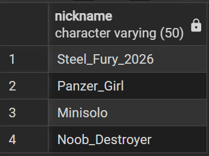
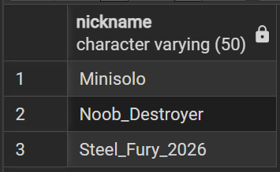
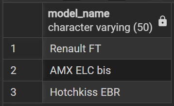
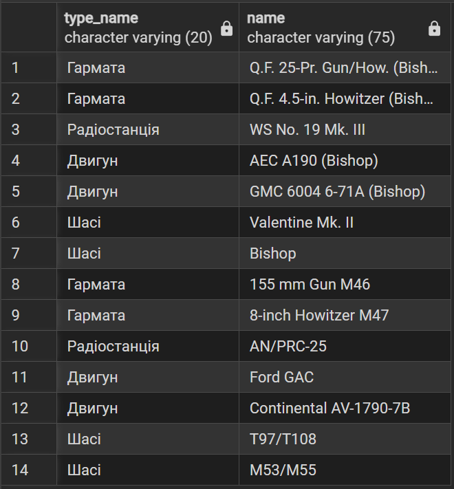
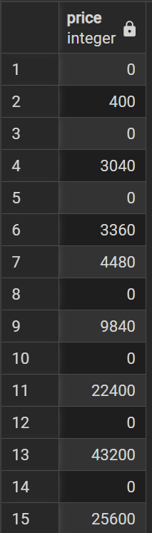
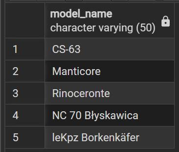
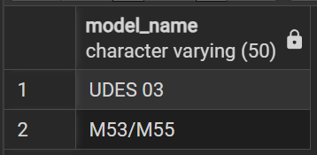
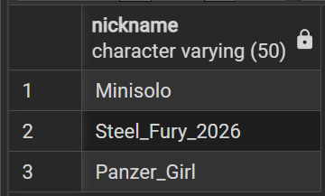

# 🎓Лабораторна робота №3
## Маніпулювання даними SQL (OLTP)
***

## ➕INSERT

```sql
INSERT INTO Nations (nation_name) VALUES 
('Німеччина'), ('СРСР'), ('США'), ('Китай'),('Франція'), ('Великобританія'), 
('Японія'), ('Чехословаччина'), ('Швеція'), ('Польща'), ('Італія');

INSERT INTO Vehicle_Classes (class_name) VALUES 
('Легкий танк'), ('Середній танк'), ('Важкий танк'), ('ПТ-САУ'), ('САУ');

INSERT INTO Vehicle_Roles (role_name) VALUES 
('Легкий танк універсальний'), ('Легкий танк колісний'),
('Середній танк штурмовий'), ('Середній танк універсальний'), ('Середній танк снайперський'), ('Середній танк підтримки'),
('Важкий танк штурмовий'), ('Важкий танк універсальний'), ('Важкий танк прориву'), ('Важкий танк підтримки'),
('ПТ-САУ штурмова'), ('ПТ-САУ універсальна'), ('ПТ-САУ снайперська'), ('ПТ-САУ підтримки'),
('САУ');

INSERT INTO Vehicles (model_name, tier, price, class_id, role_id, nation_id) VALUES 
('Renault FT', 'I', 0, 1, NULL, 5),
('Panzerjäger I', 'II', 3800, 4, NULL, 1),
('Pz.Kpfw. I Ausf. C', 'III', 38000, 1, NULL, 1),
('Matilda', 'IV', 140000, 2, NULL, 6),
('AMX ELC bis', 'V', 380000, 1, NULL, 5),
('O-I', 'VI', 920000, 3, 10, 7),
('Bishop', 'V', 370000, 5, NULL, 6),
('Hotchkiss EBR', 'VII', 1350000, 1, 2, 5),
('Panther', 'VII', 1350000, 2, 6, 1),
('UDES 03', 'VIII', 2600000, 4, 13, 9),
('P.44 Pantera', 'VIII', 2420000, 2, 6, 11),
('TNH 105/1000', 'VIII', 2550000, 3, 7, 8),
('M53/M55', 'IX', 3550000, 5, 15, 3),
('Tortoise', 'IX', 3550000, 4, 10, 6),
('Standard B', 'IX', 3500000, 2, 6, 11),
('CS-63', 'X', 6100000, 2, 4, 10),
('Manticore', 'X', 6100000, 1, 1, 6),
('Rinoceronte', 'X', 6100000, 3, 9, 11),
('NC 70 Błyskawica', 'X', 6100000, 4, 12, 10),
('leKpz Borkenkäfer', 'XI', 7400000, 1, 1, 1);
```

```sql
INSERT INTO Module_Types (type_name) VALUES 
('Гармата'), ('Башта'), ('Двигун'), ('Шасі'), ('Радіостанція');

INSERT INTO Modules (name, type_id, price) VALUES
-- Renault FT
('37 mm APX SA18 (FT)', 1, 0),
('13.2 mm Hotchkiss mle. 1930 (FT)', 1, 500),
('Renault FT Berliet', 2, 0),
('ER 52', 5, 450),
('Renault (FT)', 3, 0),
('M26/27', 4, 0),

-- Panzerjäger I
('3,7 cm Pak (t) L/47', 1, 0),
('4,7 cm Pak (t) L/43', 1, 3800),
('FuG 2', 5, 0),
('Krupp M311', 3, 0),
('Maybach HL 38 TR', 3, 1450),
('Panzerjäger I', 4, 0),
('Panzerjäger I verstärkteketten', 4, 1100),

-- Pz.Kpfw. I Ausf. C
('2 cm Kw.K. 38', 1, 0),
('2 cm Flak 38', 1, 4200),
('7,92 mm Mauser E.W. 141', 1, 5600),
('Pz.Kpfw. I Breda', 2, 0),
('Pz.Kpfw. I Ausf. C', 2, 2100),
('FuG 5', 5, 0),
('FuG 7', 5, 3200),
('Fu.Spr.Ger. "a"', 5, 4500),
('Maybach HL 45 P', 3, 0),
('Maybach HL 66 P', 3, 4800),
('VK 6.01', 4, 0),
('VK 6.02', 4, 3400),

-- Matilda
('QF 2-pdr Mk. X (A12)', 1, 0),
('QF 2-pdr Mk. X-B', 1, 12300),
('Matilda Mk. IIA', 2, 0),
('Matilda Mk. IIA*', 2, 5800),
('WS No. 19 Mk. II', 5, 0),
('2x AEC', 3, 0),
('2x Leyland E164', 3, 7200),
('Matilda Mk. II', 4, 0),
('Matilda Mk. IIA', 4, 6100),

-- AMX ELC bis
('75 mm SA44L', 1, 0),
('90 mm D. 915', 1, 28000),
('AMX ELC bis', 2, 0),
('SCR 508', 5, 0),
('SOFAM de 150 cv', 3, 0),
('SOFAM de 180 cv', 3, 15400),
('AMX ELC', 4, 0),
('AMX ELC bis', 4, 11200),

-- O-I
('10 cm Cannon Type 92 (O-I)', 1, 0),
('15 cm Howitzer Type 96 (O-I)', 1, 54000),
('O-I', 2, 0),
('Type 96 Mk. 4 Bo', 5, 0),
('2x Kawasaki Type 98 Kou (O-I)', 3, 0),
('2x Kawasaki Type 98 Otsu (O-I)', 3, 34000),
('O-I', 4, 0),
('O-I Kai', 4, 21200),

-- Bishop
('Q.F. 25-Pr. Gun/How. (Bishop)', 1, 0),
('Q.F. 4.5-in. Howitzer (Bishop)', 1, 32000),
('WS No. 19 Mk. III', 5, 0),
('AEC A190 (Bishop)', 3, 0),
('GMC 6004 6-71A (Bishop)', 3, 16500),
('Valentine Mk. II', 4, 0),
('Bishop', 4, 12600),

-- Hotchkiss EBR
('75 mm SA49 (EBR)', 1, 0),
('Canon de 75 mm Vo 1000 m/s (EBR)', 1, 59500),
('Hotchkiss EBR', 2, 0),
('SCR-528 F', 5, 0),
('Hotchkiss V6 mle. 48', 3, 0),
('Hotchkiss V6 mle. 50', 3, 42000),
('Hotchkiss EBR', 4, 0),
('Hotchkiss EBR bis', 4, 33100),

-- Panther
('7,5 cm Kw.K. 42 L/70 Ausf. A', 1, 0),
('7,5 cm Kw.K. 42 L/70 Ausf. G', 1, 62000),
('Pz.Kpfw. Panther Ausf. G', 2, 0),
('Pz.Kpfw. Panther Schmalturm', 2, 34000),
('FuG 12', 5, 0),
('Maybach HL 210 TRM P30 (G)', 3, 0),
('Maybach HL 230 TRM P30 (G)', 3, 45000),
('Pz.Kpfw. Panther Ausf. A', 4, 0),
('Pz.Kpfw. Panther Ausf. G', 4, 25400),

-- UDES 03
('9 cm kan m/F', 1, 0),
('10,5 cm kan UDES 03', 1, 115000),
('Ra 421', 5, 0),
('Saab-Scania DS14', 3, 0),
('Leyland L60', 3, 72000),
('Projekt 2013A', 4, 0),
('UDES 03', 4, 51000),

-- P.44 Pantera
('Cannone da 90/53', 1, 0),
('Cannone da 90/74', 1, 121000),
('P.44 Pantera prima variante', 2, 0),
('P.44 Pantera seconda variante', 2, 48000),
('R.F. 4 M.', 5, 0),
('Alfa RA1000I C.A.', 3, 0),
('FIAT RA1050I C.A.', 3, 75000),
('P.44 Pantera', 4, 0),
('P.44 Pantera v.s.', 4, 46000),

-- TNH 105/1000
('105 mm vz. 38N', 1, 0),
('105 mm vz. 38N (a)', 1, 142000),
('105 mm vz. 40N (1000)', 1, 185000),
('TNH 105/1000 první model', 2, 0),
('TNH 105/1000 druhý model', 2, 62000),
('Radiostanice RM-31T', 5, 0),
('ČKD AXK proto', 3, 0),
('Škoda V16 AHK-2', 3, 105000),
('TNH 105/1000 (1947)', 4, 0),
('TNH 105/1000 (1948)', 4, 61000),

-- M53/M55
('155 mm Gun M46', 1, 0),
('8-inch Howitzer M47', 1, 210000),
('AN/PRC-25', 5, 0),
('Ford GAC', 3, 0),
('Continental AV-1790-7B', 3, 115000),
('T97/T108', 4, 0),
('M53/M55', 4, 65000),

-- Tortoise
('OQF 32-pdr AT Gun (A39)', 1, 0),
('120 mm AT Gun L1A1', 1, 245000),
('SR C42', 5, 0),
('Rolls-Royce Meteor Mk. V', 3, 0),
('Rolls-Royce Meteor M120 (A39)', 3, 98000),
('Tortoise', 4, 0),
('Tortoise Mk. 2', 4, 63000),

-- Standard B
('Cannone da 90 Rh', 1, 0),
('Cannone da 105 Rh V1', 1, 195000),
('Prototipo Standard A (W 2)', 2, 0),
('Prototipo Standard B (R 1)', 2, 61000),
('RV 4', 5, 0),
('MB 837 Aa', 3, 0),
('MB 837 Ea', 3, 102000),
('Prototipo Standard B I', 4, 0),
('Prototipo Standard B II', 4, 62000),

-- CS-63
('105 mm armata wz. 64', 1, 0),
('CS-63', 2, 0),
('R-123', 5, 0),
('SGT-3CzM', 3, 0),
('CS-63', 4, 0),

-- Manticore
('QF 105 mm Gun', 1, 0),
('Manticore 1955', 2, 0),
('C42 VHF', 5, 0),
('Rolls-Royce B81 (1955)', 3, 0),
('Manticore 1955', 4, 0),

-- Rinoceronte
('127 mm OTO Melara', 1, 0),
('Rinoceronte', 2, 0),
('SEM-25', 5, 0),
('Daimler–Benz Typ MB 838', 3, 0),
('Rinoceronte', 4, 0),

-- NC 70 Błyskawica
('GG-85/175 mm', 1, 0),
('R-123', 5, 0),
('2x GTD-2T6', 3, 0),
('NC 70 Błyskawica', 4, 0),

-- leKpz Borkenkäfer
('105 mm Rh 105-20', 1, 0),
('leKpz Borkenkäfer', 2, 0),
('SEM 25BK', 5, 0),
('MAN D2840 LXE', 3, 0),
('leKpz Borkenkäfer', 4, 0);
```

```sql
-- Renault FT
INSERT INTO Compatibility (vehicle_id, module_id)
SELECT v.vehicle_id, m.module_id FROM Vehicles v, Modules m 
WHERE v.model_name = 'Renault FT' AND m.name IN ('37 mm APX SA18 (FT)', '13.2 mm Hotchkiss mle. 1930 (FT)',
'Renault FT Berliet', 'ER 52', 'Renault (FT)', 'M26/27');

-- Panzerjäger I
INSERT INTO Compatibility (vehicle_id, module_id)
SELECT v.vehicle_id, m.module_id FROM Vehicles v, Modules m 
WHERE v.model_name = 'Panzerjäger I' AND m.name IN ('3,7 cm Pak (t) L/47', '4,7 cm Pak (t) L/43', 'FuG 2',
'Krupp M311', 'Maybach HL 38 TR', 'Panzerjäger I', 'Panzerjäger I verstärkteketten');

-- Pz.Kpfw. I Ausf. C
INSERT INTO Compatibility (vehicle_id, module_id)
SELECT v.vehicle_id, m.module_id FROM Vehicles v, Modules m 
WHERE v.model_name = 'Pz.Kpfw. I Ausf. C' AND m.name IN ('2 cm Kw.K. 38', '2 cm Flak 38', '7,92 mm Mauser E.W. 141',
'Pz.Kpfw. I Breda', 'Pz.Kpfw. I Ausf. C', 'FuG 5', 'FuG 7', 'Fu.Spr.Ger. "a"', 'Maybach HL 45 P', 'Maybach HL 66 P',
'VK 6.01', 'VK 6.02');

-- Matilda
INSERT INTO Compatibility (vehicle_id, module_id)
SELECT v.vehicle_id, m.module_id FROM Vehicles v, Modules m 
WHERE v.model_name = 'Matilda' AND m.name IN ('QF 2-pdr Mk. X (A12)', 'QF 2-pdr Mk. X-B', 'Matilda Mk. IIA',
'Matilda Mk. IIA*', 'WS No. 19 Mk. II', '2x AEC', '2x Leyland E164', 'Matilda Mk. II', 'Matilda Mk. IIA');

-- AMX ELC bis
INSERT INTO Compatibility (vehicle_id, module_id)
SELECT v.vehicle_id, m.module_id FROM Vehicles v, Modules m 
WHERE v.model_name = 'AMX ELC bis' AND m.name IN ('75 mm SA44L', '90 mm D. 915', 'AMX ELC bis', 'SCR 508',
'SOFAM de 150 cv', 'SOFAM de 180 cv', 'AMX ELC', 'AMX ELC bis');

-- O-I
INSERT INTO Compatibility (vehicle_id, module_id)
SELECT v.vehicle_id, m.module_id FROM Vehicles v, Modules m 
WHERE v.model_name = 'O-I' AND m.name IN ('10 cm Cannon Type 92 (O-I)', '15 cm Howitzer Type 96 (O-I)', 'O-I',
'Type 96 Mk. 4 Bo', '2x Kawasaki Type 98 Kou (O-I)', '2x Kawasaki Type 98 Otsu (O-I)', 'O-I', 'O-I Kai');

-- Bishop
INSERT INTO Compatibility (vehicle_id, module_id)
SELECT v.vehicle_id, m.module_id FROM Vehicles v, Modules m 
WHERE v.model_name = 'Bishop' AND m.name IN ('Q.F. 25-Pr. Gun/How. (Bishop)', 'Q.F. 4.5-in. Howitzer (Bishop)',
'WS No. 19 Mk. III', 'AEC A190 (Bishop)', 'GMC 6004 6-71A (Bishop)', 'Valentine Mk. II', 'Bishop');

-- Hotchkiss EBR
INSERT INTO Compatibility (vehicle_id, module_id)
SELECT v.vehicle_id, m.module_id FROM Vehicles v, Modules m 
WHERE v.model_name = 'Hotchkiss EBR' AND m.name IN ('75 mm SA49 (EBR)', 'Canon de 75 mm Vo 1000 m/s (EBR)',
'Hotchkiss EBR', 'SCR-528 F', 'Hotchkiss V6 mle. 48', 'Hotchkiss V6 mle. 50', 'Hotchkiss EBR', 'Hotchkiss EBR bis');

-- Panther
INSERT INTO Compatibility (vehicle_id, module_id)
SELECT v.vehicle_id, m.module_id FROM Vehicles v, Modules m 
WHERE v.model_name = 'Panther' AND m.name IN ('7,5 cm Kw.K. 42 L/70 Ausf. A', '7,5 cm Kw.K. 42 L/70 Ausf. G',
'Pz.Kpfw. Panther Ausf. G', 'Pz.Kpfw. Panther Schmalturm', 'FuG 12', 'Maybach HL 210 TRM P30 (G)',
'Maybach HL 230 TRM P30 (G)', 'Pz.Kpfw. Panther Ausf. A', 'Pz.Kpfw. Panther Ausf. G');

-- UDES 03
INSERT INTO Compatibility (vehicle_id, module_id)
SELECT v.vehicle_id, m.module_id FROM Vehicles v, Modules m 
WHERE v.model_name = 'UDES 03' AND m.name IN ('9 cm kan m/F', '10,5 cm kan UDES 03', 'Ra 421', 'Saab-Scania DS14',
'Leyland L60', 'Projekt 2013A', 'UDES 03');

-- P.44 Pantera
INSERT INTO Compatibility (vehicle_id, module_id)
SELECT v.vehicle_id, m.module_id FROM Vehicles v, Modules m 
WHERE v.model_name = 'P.44 Pantera' AND m.name IN ('Cannone da 90/53', 'Cannone da 90/74',
'P.44 Pantera prima variante','P.44 Pantera seconda variante', 'R.F. 4 M.', 'Alfa RA1000I C.A.',
'FIAT RA1050I C.A.', 'P.44 Pantera', 'P.44 Pantera v.s.');

-- TNH 105/1000
INSERT INTO Compatibility (vehicle_id, module_id)
SELECT v.vehicle_id, m.module_id FROM Vehicles v, Modules m 
WHERE v.model_name = 'TNH 105/1000' AND m.name IN ('105 mm vz. 38N', '105 mm vz. 38N (a)', '105 mm vz. 40N (1000)',
'TNH 105/1000 první model', 'TNH 105/1000 druhý model', 'Radiostanice RM-31T', 'ČKD AXK proto', 'Škoda V16 AHK-2',
'TNH 105/1000 (1947)', 'TNH 105/1000 (1948)');

-- M53/M55
INSERT INTO Compatibility (vehicle_id, module_id)
SELECT v.vehicle_id, m.module_id FROM Vehicles v, Modules m 
WHERE v.model_name = 'M53/M55' AND m.name IN ('155 mm Gun M46', '8-inch Howitzer M47', 'AN/PRC-25', 'Ford GAC',
'Continental AV-1790-7B', 'T97/T108', 'M53/M55');

-- Tortoise
INSERT INTO Compatibility (vehicle_id, module_id)
SELECT v.vehicle_id, m.module_id FROM Vehicles v, Modules m 
WHERE v.model_name = 'Tortoise' AND m.name IN ('OQF 32-pdr AT Gun (A39)', '120 mm AT Gun L1A1', 'SR C42',
'Rolls-Royce Meteor Mk. V', 'Rolls-Royce Meteor M120 (A39)', 'Tortoise', 'Tortoise Mk. 2');

-- Standard B
INSERT INTO Compatibility (vehicle_id, module_id)
SELECT v.vehicle_id, m.module_id FROM Vehicles v, Modules m 
WHERE v.model_name = 'Standard B' AND m.name IN ('Cannone da 90 Rh', 'Cannone da 105 Rh V1',
'Prototipo Standard A (W 2)', 'Prototipo Standard B (R 1)', 'RV 4', 'MB 837 Aa', 'MB 837 Ea',
'Prototipo Standard B I', 'Prototipo Standard B II');

-- CS-63
INSERT INTO Compatibility (vehicle_id, module_id)
SELECT v.vehicle_id, m.module_id FROM Vehicles v, Modules m 
WHERE v.model_name = 'CS-63' AND m.name IN ('105 mm armata wz. 64', 'CS-63', 'R-123', 'SGT-3CzM', 'CS-63');

-- Manticore
INSERT INTO Compatibility (vehicle_id, module_id)
SELECT v.vehicle_id, m.module_id FROM Vehicles v, Modules m 
WHERE v.model_name = 'Manticore' AND m.name IN ('QF 105 mm Gun', 'Manticore 1955', 'C42 VHF',
'Rolls-Royce B81 (1955)', 'Manticore 1955');

-- Rinoceronte
INSERT INTO Compatibility (vehicle_id, module_id)
SELECT v.vehicle_id, m.module_id FROM Vehicles v, Modules m 
WHERE v.model_name = 'Rinoceronte' AND m.name IN ('127 mm OTO Melara', 'Rinoceronte', 'SEM-25',
'Daimler–Benz Typ MB 838', 'Rinoceronte');

-- NC 70 Błyskawica
INSERT INTO Compatibility (vehicle_id, module_id)
SELECT v.vehicle_id, m.module_id FROM Vehicles v, Modules m 
WHERE v.model_name = 'NC 70 Błyskawica' AND m.name IN ('GG-85/175 mm', 'R-123', '2x GTD-2T6', 'NC 70 Błyskawica');

-- leKpz Borkenkäfer
INSERT INTO Compatibility (vehicle_id, module_id)
SELECT v.vehicle_id, m.module_id FROM Vehicles v, Modules m 
WHERE v.model_name = 'leKpz Borkenkäfer' AND m.name IN ('105 mm Rh 105-20', 'leKpz Borkenkäfer', 'SEM 25BK',
'MAN D2840 LXE', 'leKpz Borkenkäfer');
```

```sql
-- Гравці
INSERT INTO Players (nickname, email, credits) VALUES 
('Minisolo', 'minisolo.play@gmail.com', 15000000),
('Steel_Fury_2026', 'fury@gmail.com', 450000),
('Noob_Destroyer', 'destroyer@gmail.com', 50000),
('Panzer_Girl', 'panzer@gmail.com', 2300000);

-- Наповнення ангару (Купуємо танки)
INSERT INTO Hangar (player_id, vehicle_id, current_exp, purchase_date) VALUES 
-- Minisolo
((SELECT player_id FROM Players WHERE nickname = 'Minisolo'), 
 (SELECT vehicle_id FROM Vehicles WHERE model_name = 'CS-63'), 150000, '2026-01-15 10:30:00'),

((SELECT player_id FROM Players WHERE nickname = 'Minisolo'), 
 (SELECT vehicle_id FROM Vehicles WHERE model_name = 'Manticore'), 89000, '2026-02-10 14:20:00'),

((SELECT player_id FROM Players WHERE nickname = 'Minisolo'), 
 (SELECT vehicle_id FROM Vehicles WHERE model_name = 'Panther'), 250000, '2025-12-01 09:00:00'),

((SELECT player_id FROM Players WHERE nickname = 'Minisolo'), 
 (SELECT vehicle_id FROM Vehicles WHERE model_name = 'Hotchkiss EBR'), 75000, '2025-9-07 21:40:00'),

-- Steel_Fury_2026
((SELECT player_id FROM Players WHERE nickname = 'Steel_Fury_2026'), 
 (SELECT vehicle_id FROM Vehicles WHERE model_name = 'O-I'), 45000, '2026-03-05 18:45:00'),

((SELECT player_id FROM Players WHERE nickname = 'Steel_Fury_2026'), 
 (SELECT vehicle_id FROM Vehicles WHERE model_name = 'AMX ELC bis'), 12000, '2026-03-12 21:10:00'),

-- Noob_Destroyer
((SELECT player_id FROM Players WHERE nickname = 'Noob_Destroyer'), 
 (SELECT vehicle_id FROM Vehicles WHERE model_name = 'Renault FT'), 500, '2026-03-18 12:00:00'),

-- Panzer_Girl
((SELECT player_id FROM Players WHERE nickname = 'Panzer_Girl'), 
 (SELECT vehicle_id FROM Vehicles WHERE model_name = 'UDES 03'), 67000, '2026-02-20 11:00:00'),

((SELECT player_id FROM Players WHERE nickname = 'Panzer_Girl'), 
 (SELECT vehicle_id FROM Vehicles WHERE model_name = 'M53/M55'), 110000, '2026-01-30 16:30:00');
```

***

## 🔍SELECT

```sql
-- Вивести нікнейми гравців, які мають хоча б один танк у своєму ангарі.
SELECT DISTINCT p.nickname
FROM Hangar h
JOIN Players p ON h.player_id = p.player_id
```


```sql
-- Вивести нікнейми гравців, у яких в ангарі є хоча б один танк, що належить до класу 'Легкий танк'.
SELECT DISTINCT p.nickname
FROM Hangar h
JOIN Players p ON h.player_id = p.player_id
JOIN Vehicles v ON h.vehicle_id = v.vehicle_id
JOIN Vehicle_Classes vc ON v.class_id = vc.class_id
WHERE vc.class_name = 'Легкий танк';
```


```sql
-- Вивести назви всіх моделей техніки, що належать до нації 'Франція'.
SELECT model_name
FROM Vehicles v
JOIN Nations n ON v.nation_id = n.nation_id
WHERE n.nation_name = 'Франція';
```


```sql
-- Вивести перелік усіх доступних модулів (їх назву та тип) для техніки, що відноситься до класу 'САУ'.
SELECT mt.type_name ,m.name
FROM Modules m
JOIN Module_Types mt ON m.type_id = mt.type_id
JOIN Compatibility c ON m.module_id = c.module_id
JOIN Vehicles v ON c.vehicle_id = v.vehicle_id
JOIN Vehicle_Classes vc ON v.class_id = vc.class_id
WHERE vc.class_name = 'САУ';
```


***

## 🔄UPDATE

```sql
-- Знизити вартість усіх модулів типу 'Гармата' на 20%, щоб зробити їх доступнішими для новачків.
UPDATE Modules 
SET price = price * 0.8 
WHERE type_id = (SELECT type_id FROM Module_Types WHERE type_name = 'Гармата');
```


```sql
-- Перевести танк 'leKpz Borkenkäfer' з XI рівня на X рівень.
UPDATE Vehicles 
SET tier = 'X' 
WHERE model_name = 'leKpz Borkenkäfer';
```


```sql
-- Гравець 'Minisolo' провів вдалий бій на танку 'Hotchkiss EBR'. Додати йому 1749 досвіду в ангарі.
UPDATE Hangar
SET current_exp = current_exp + 1749
WHERE player_id = (SELECT player_id FROM Players WHERE nickname = 'Minisolo')
AND vehicle_id = (SELECT vehicle_id FROM Vehicles WHERE model_name = 'Hotchkiss EBR');
```


***

## 🗑️DELETE

```sql
-- Видалити запис про володіння танком 'UDES 03' з ангару гравця 'Panzer_Girl'.
DELETE FROM Hangar 
WHERE player_id = (SELECT player_id FROM Players WHERE nickname = 'Panzer_Girl')
AND vehicle_id = (SELECT vehicle_id FROM Vehicles WHERE model_name = 'UDES 03');
```
До:


Після:


```sql
-- Видалити гравця 'Noob_Destroyer' та всі його дані (ангар очиститься автоматично через CASCADE).
DELETE FROM Players 
WHERE nickname = 'Noob_Destroyer';
```


***

⚙️ Усі SQL-скрипти виконуються коректно.
