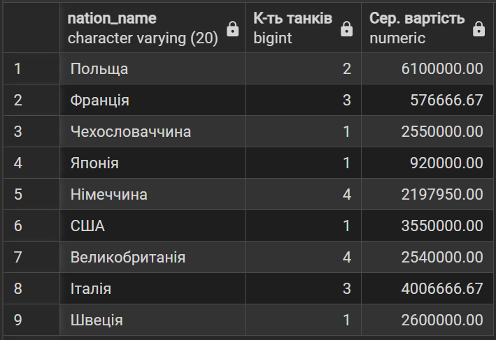
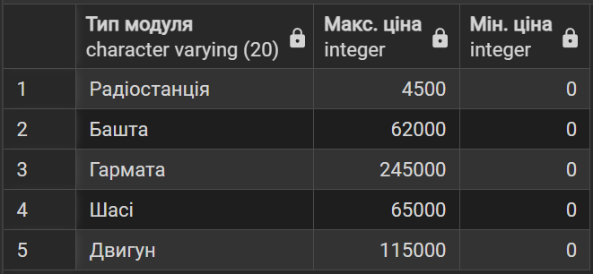
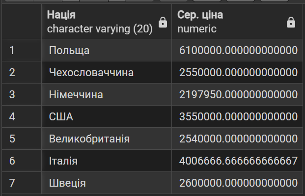
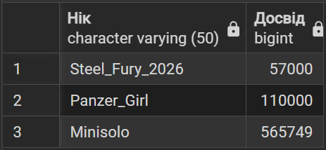
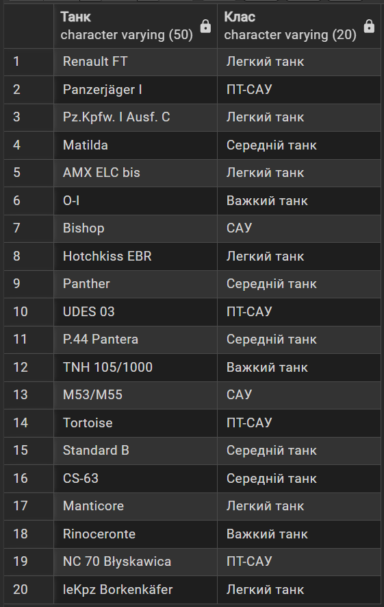
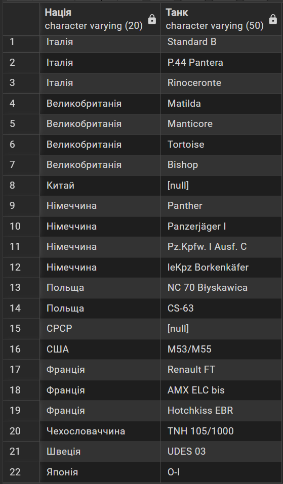
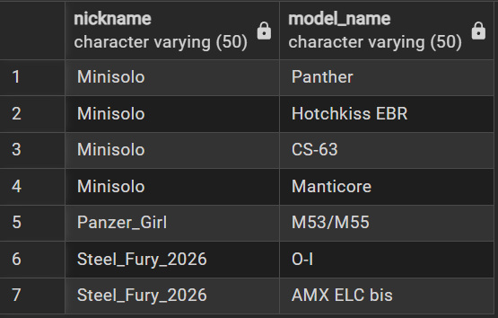
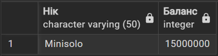
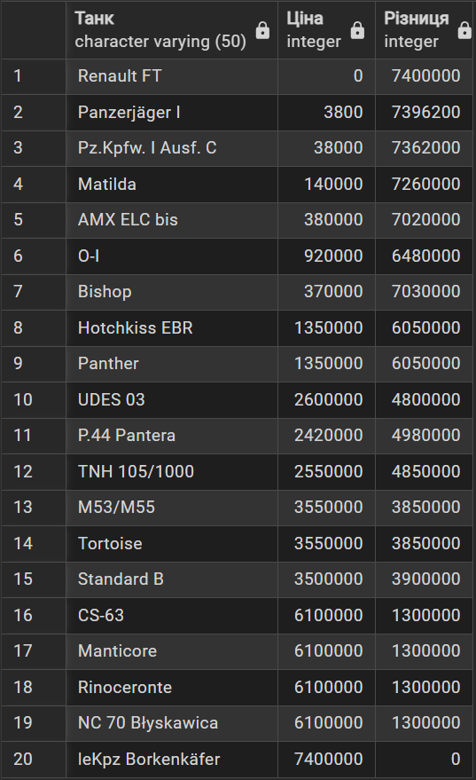
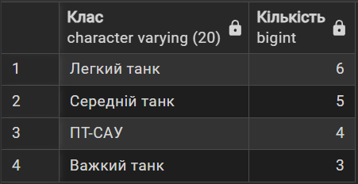

# 🎓Лабораторна робота №4
## Аналітичні SQL-запити (OLAP)
***

## 📈Агрегація

```sql
-- Підрахувати загальну кількість танків та їхню середню вартість для кожної нації.
SELECT n.nation_name, COUNT(v.vehicle_id) AS "К-ть танків", ROUND(AVG(v.price), 2) AS "Сер. вартість"
FROM Vehicles v
JOIN Nations n ON v.nation_id = n.nation_id
GROUP BY n.nation_name
```


```sql
-- Знайти мінімальну та максимальну ціну модуля для кожного типу (Гармата, Двигун і т.д.).
SELECT mt.type_name AS "Тип модуля", MAX(m.price) AS "Макс. ціна", MIN(m.price) AS "Мін. ціна"
FROM Modules m
JOIN Module_Types mt ON m.type_id = mt.type_id
GROUP BY mt.type_name
```


```sql
-- Знайти нації, у яких середня ціна танка перевищує 2000000 кредитів.
SELECT n.nation_name AS "Нація", AVG(v.price) AS "Сер. ціна"
FROM Vehicles v
JOIN Nations n ON v.nation_id = n.nation_id
GROUP BY n.nation_name
HAVING AVG(v.price) > 2000000
```


```sql
-- Підрахувати сумарний досвід, накопичений кожним гравцем у його ангарі.
SELECT p.nickname AS "Нік", SUM(h.current_exp) AS "Досвід"
FROM Players p
JOIN Hangar h ON p.player_id = h.player_id
GROUP BY p.nickname
```


***

## 🔗Джоіни

```sql
-- Вивести назви танків та назви їхніх класів.
SELECT v.model_name AS "Танк", vc.class_name AS "Клас" 
FROM Vehicles v
INNER JOIN Vehicle_Classes vc ON v.class_id = vc.class_id
```


```sql
-- Вивести всі нації та назви танків, що до них відносяться.
SELECT n.nation_name AS "Нація", v.model_name AS "Танк"
FROM Nations n
LEFT JOIN Vehicles v ON n.nation_id = v.nation_id
ORDER BY n.nation_name
```


```sql
-- Об'єднати гравців та їхні танки в ангарі.
SELECT p.nickname, v.model_name
FROM Players p
FULL JOIN Hangar h ON p.player_id = h.player_id
LEFT JOIN Vehicles v ON h.vehicle_id = v.vehicle_id
ORDER BY p.nickname
```


***

## 🔄Підзапити

```sql
-- Знайти гравців, чий баланс кредитів вищий за середній по всій базі.
SELECT nickname AS "Нік", credits AS "Баланс"
FROM Players
WHERE credits > (SELECT AVG(credits) FROM PLAYERS)
```


```sql
-- Для кожного танка вивести його ціну та різницю з ціною найдорожчого танка в грі.
SELECT model_name AS "Танк", price AS "Ціна", (SELECT MAX(price) FROM Vehicles) - price AS "Різниця"
FROM Vehicles
```


```sql
-- Знайти класи танків, кількість машин у яких більша, ніж у класі "САУ".
SELECT vc.class_name AS "Клас", COUNT(v.vehicle_id) AS "Кількість"
FROM Vehicles v
JOIN Vehicle_Classes vc ON v.class_id = vc.class_id
GROUP BY vc.class_name
HAVING COUNT(v.vehicle_id) > (
	SELECT COUNT(*)
	FROM Vehicles v2
	JOIN Vehicle_classes vc2 ON v2.class_id = vc2.class_id
	WHERE vc2.class_name = 'САУ'
)
```


***

⚙️ Усі SQL-скрипти виконуються коректно.